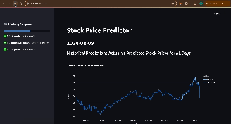
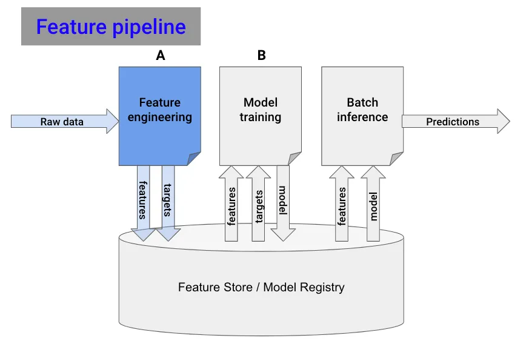
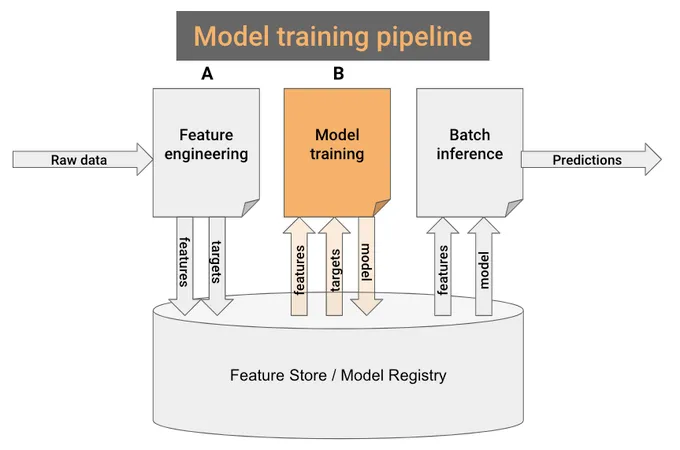
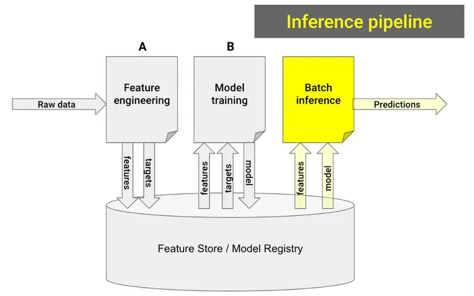

# Stock Price Prediction Service

## Demo


##### Credits: Pau Labarta Bajo

## High-Level Overview
### 3-Pipeline Design 


Ingests raw data and outputs realtime model predictions on a schedule. Feautre pipeline is scheduled to run everyday, training/inference pipeline is scheduled to run after completion of feature pipeline. 
#### Feature Pipeline


The feature pipeline ingests raw stock price data from the api and performs data preprocessing to transform it into features/targets. 

1) First it loads and validates raw data to make sure the stock price data we requested from the API is within the date range and from the company.

2) Then it transforms this raw data a into time-series data. This includes handling missing days in the data with interpolation, backfill, frontfill. We also perform feature engineering to create new feautres per day from the features given from the API. 

3) Transforms time-series data into features/targets. Example shape of features/targets and how we do it. Features shape (number_of_sequences, sequence_length, number_of_features), each sequence is an example, sequence_length is number of days in each example, sequence_length is values per day. features[sequence-example-index][day-in-sequence-index][feature-value-index-in-day]. targets = [price, price, price,..]
```python
features, targets = transform_ts_data_into_features_target(ts_prices, n_previous_days, step_size)
```
4) Saves features/targets in the feature store. 


#### Model Training Pipeline


1) Loads features/targets from feature store. 
2) Create model, train model on features/targets, save model in model registry. The output of model is the close price for that stock for that day, takes in input sequences of days and the next day in that sequence as label/target. 
```python
# LIGHTGBM REGRESSOR MODEL
import lightgbm as lgb
from sklearn.model_selection import train_test_split
from sklearn.metrics import mean_squared_error


num_samples, sequence_length, num_features = X.shape
X_flattened = X.reshape(num_samples, sequence_length * num_features)

# Create the LightGBM Regressor model
lgb_model = lgb.LGBMRegressor(objective='regression', n_estimators=100, learning_rate=0.1, max_depth=-1, random_state=42)

# Train the model
lgb_model.fit(X_flattened, Y)

# Predict on the test set
y_pred = lgb_model.predict(X_flattened)

# Calculate the mean squared error
mse = mean_squared_error(Y, y_pred)
print(f"Mean Squared Error: {mse}")

# Print the first few predictions and actual values
print("Predictions:", y_pred[:5])
print("Actual values:", Y[:5])
```
#### Inference Pipeline


1) Load features/targets from feature store
2) Load model from model registry
3) Compute historical/future predictions using model.
4) Save historical/future predictions in hopsworks. 

In frontend.py streamlit file we load these predictions from hopsworks to display. 
```python
ts_prices = load_batch_of_features_from_store() 
model = load_model_from_registry() 
historical_predictions = get_model_predictions(model, features, ts_prices) 

```

### Features
- Predictions for historical data
- Predictions for future days


## Tech stack
#### API's
- Polygon.ai for historical stock data. 
- Hopsworks for feature store and model registry
#### Libraries
- Streamlit: for frontend displaying data
- Numpy,Pandas: for data handling 
- Github Actions: for pipeline automation/scheduling