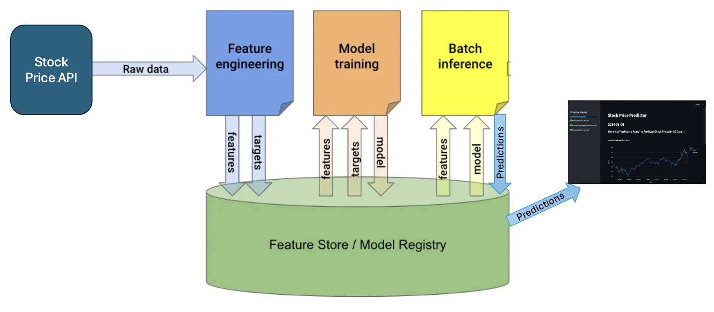

# Stock Price Prediction Service

## Demo
Video
##### Credits: Pau Labarta Bajo

## High-Level Overview
### 3-Pipeline Design 

#### Feature Pipeline
TBD
#### Model Training Pipeline
TBD
#### Inference Pipeline
TBD
### Features
- Predictions for historical data
- Predictions for future days

## Tech stack
#### API's
- Polygon.ai for historical stock data. 
- Hopsworks for feature store and model registry
#### Libraries
- Streamlit: for frontend displaying data
- Numpy,Pandas: for data handling 